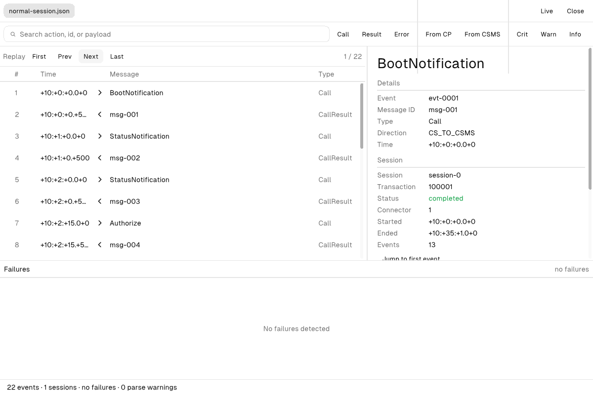

# OCPP DebugKit Studio

[](https://github.com/ocpp-debugkit/studio/actions/workflows/ci.yml)
[](LICENSE)

> A native desktop debugger for OCPP charging sessions — the bench instrument of the OCPP DebugKit ecosystem.

**OCPP DebugKit Studio** is a native desktop application for engineers building and operating OCPP charge points and CSMS backends. Think of it as *Wireshark for OCPP*: sit between a charging station and its backend, decode every frame live, flag protocol failures as they happen, and keep a high-performance offline inspector for the traces you capture.

Studio is built in [Zig](https://ziglang.org) on the [Native SDK](https://github.com/vercel-labs/native) — native-rendered, no browser, no Electron. It starts instantly, stays small, and does the things a browser tab fundamentally cannot: open raw sockets, watch the filesystem, and run for days as a background monitor.



## The ecosystem

Studio is one of two independent products under the OCPP DebugKit umbrella:

| Project | Language | Surface | Role |
| --- | --- | --- | --- |
| [`@ocpp-debugkit/toolkit`](https://github.com/ocpp-debugkit/toolkit) | TypeScript | npm library · CLI · web app | The library and CI brain — parse, analyze, and report OCPP traces anywhere |
| **`ocpp-debugkit/studio`** (this repo) | Zig | native desktop app | The instrument on the bench — live capture, native performance, OS integration |

The two share **no code**. They meet only at a *conformance contract*: the same trace format, the same normalized event model, the same failure taxonomy, and the same scenario fixtures. A trace captured in Studio opens in the toolkit's web inspector, and vice versa — two independent implementations, one format, checked in CI on every change. See **[the conformance contract](docs/CONTRACT.md)** (`contract-v1`) and [ADR-0001](docs/adr/0001-independent-implementation.md).

## What it does

- **Inspect** — open JSON / JSONL / bare-array traces in a virtualized timeline that stays smooth past **500k events**; unpack any message (raw OCPP-J array, normalized fields, a payload disclosure tree), see the session it correlates into, and search / filter by action, direction, type, or severity.
- **Detect** — the full **OCPP 1.6J failure taxonomy** (16 rules), bit-for-bit conformant with the toolkit's reference, ranked critical → warning → info with remediation steps.
- **Watch** — a **live WebSocket proxy** between a charge point and its CSMS: decode OCPP frames in flight, run detection as events stream, record to the canonical trace format, and get an **OS notification** the moment a critical failure appears.
- **Prove** — Markdown / HTML reports, semantic trace diffing, anonymize-on-export, and step-through replay.
- **Scale** — native performance with no GC; stream-parse traces far past what a browser tab can hold.
- **Script** — the same binary is a headless CLI (`inspect` / `report` / `diff` / `anonymize` / `capture` / `ci`) for pipelines and automation.

## Install

### macOS (Apple silicon)

Paste this into a terminal — it installs the latest **OCPP DebugKit Studio** into
Applications and opens it:

```sh
curl -fsSL https://raw.githubusercontent.com/ocpp-debugkit/studio/main/scripts/install-macos.sh | bash
```

The script downloads the latest release, verifies its SHA-256, installs the app,
and launches it — no toolchain, no manual steps. (Prefer to read it first? See
[`scripts/install-macos.sh`](scripts/install-macos.sh).)

### Linux

Download the `.tar.gz` from the
[**Releases**](https://github.com/ocpp-debugkit/studio/releases) page, extract it,
and run the `studio` binary. Requires GTK 4 (`libgtk-4`, `libwebkitgtk-6.0`).

Studio is pre-1.0 (0.x) while Zig, the Native SDK, and the toolkit conformance
reference are all pre-1.0 — see the [roadmap](ROADMAP.md).

## Usage

Open a trace in the GUI, or drive the headless CLI:

```sh
studio path/to/trace.json                      # open the inspector on a trace
studio                                          # open with the built-in sample

# Live capture: proxy a charge point ↔ CSMS session and stream it to a file
studio capture --listen 127.0.0.1:9000 \
               --upstream ws://csms.example:9000/ocpp --ndjson > session.jsonl

# Headless analysis (stdout)
studio inspect trace.json                       # a parsed + analyzed summary
studio report trace.json -f html > report.html  # a full report (markdown | html)
studio diff before.json after.json              # semantic diff of two traces
studio anonymize trace.json > shareable.json    # strip sensitive fields
studio ci                                        # run the conformance contract (exit 0/1)
```

Point your charge point (or the toolkit's tooling) at the `--listen` address and
its traffic is proxied to `--upstream`, decoded, and recorded. Full CLI ⇄ toolkit
parity is documented in [docs/cli-parity.md](docs/cli-parity.md).

## Build from source

**Prerequisites:** [Zig](https://ziglang.org/download/) `0.16.0` and the Native SDK CLI (`npm install -g @native-sdk/cli`).

```sh
git clone https://github.com/ocpp-debugkit/studio.git
cd studio

native dev      # build a Debug binary and run it, with markup hot reload
native test     # run the headless test suite
native build    # produce a ReleaseFast binary in zig-out/bin/
native check    # validate src/*.native markup and app.zon
```

The `native` CLI owns the build — there is no `build.zig` to manage. To build a
distributable package, see [RELEASING.md](RELEASING.md).

## Non-goals

Studio is a debugging instrument, not infrastructure. It is **not**:

- a production CSMS, or billing / fleet management;
- a compliance certification tool (no OCTT claims);
- a cloud service — it is local-first, with no accounts and no telemetry.

## Contributing

Contributions are welcome. Start with [CONTRIBUTING.md](CONTRIBUTING.md), and point your tooling at [AGENTS.md](AGENTS.md) for a structured overview of the architecture and conventions. [CURRENT_STATE.md](CURRENT_STATE.md) tracks what is built and what is in progress; [CHANGELOG.md](CHANGELOG.md) records what shipped in each release.

## Security

Please report vulnerabilities privately via [GitHub Security Advisories](https://github.com/ocpp-debugkit/studio/security/advisories/new). See [SECURITY.md](SECURITY.md).

## License

[Apache License 2.0](LICENSE) © OCPP DebugKit Contributors
